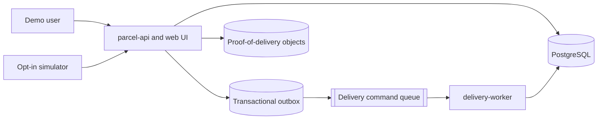

# ParcelFlow on Azure with Score

ParcelFlow is an end-to-end parcel delivery demo that defines its workloads once
with the [Score specification](https://score.dev/) and runs them locally with
`score-compose` or on Azure Kubernetes Service with `score-k8s`.

The repository demonstrates the boundary between:

- **application intent**, expressed in portable Score workload files;
- **local platform behavior**, supplied by Docker Compose provisioners; and
- **Azure platform behavior**, supplied by Bicep, workload identity, and
  Kubernetes provisioners.

> ParcelFlow is a learning and demonstration system, not a production delivery
> platform. It uses fictional data and intentionally cost-conscious Azure
> settings.

## What the demo includes

- A browser UI and REST API for creating and tracking parcels
- An asynchronous worker that advances deliveries idempotently
- PostgreSQL persistence and a transactional outbox
- RabbitMQ and Azurite adapters for local development
- Azure Service Bus and Blob Storage adapters for Azure
- Proof-of-delivery upload and retrieval
- Deterministic seed data, simulator, and end-to-end smoke checks
- Infrastructure as code for a disposable Azure environment
- Architecture, security, cost, operations, and teardown documentation

## Architecture



The same files in [`deploy/score`](deploy/score) define `parcel-api` and
`delivery-worker` for both targets. Platform-specific resource implementations
remain outside those workload files.

See [Architecture](docs/architecture.md) and
[How Score is used](docs/score.md) for the full design.

## Repository layout

```text
api/                 OpenAPI contract
cmd/                 API, worker, simulator, and smoke commands
deploy/score/        Portable Score workload definitions
deploy/score-compose/ Local resource provisioners
deploy/k8s/          Kind and Azure provisioners and policy patches
docs/                Design, operations, security, cost, and demo guidance
infra/               Azure Bicep modules and environment parameters
internal/            Go domain and infrastructure packages
migrations/          Versioned database schema and seed data
scripts/local/       Local and Kind workflows
scripts/azure/       Azure preflight, deployment, validation, and teardown
web/                 Embedded UI assets
```

## Prerequisites

For local development:

- Git
- Go as pinned in `go.mod`
- Docker Desktop with Linux containers
- `score-compose`

For the Kind parity test:

- `kubectl`
- Kind
- `score-k8s`

For Azure:

- Azure CLI with Bicep
- Access to an Azure subscription
- Permission to deploy resources and role assignments
- `kubectl`
- `kubelogin`
- `score-k8s`

The helper scripts fail with actionable messages when a required tool is
missing. Tool versions are pinned or checked where reproducibility requires it.

## Local quickstart

Start Docker Desktop first, then run:

```powershell
.\scripts\local\preflight.ps1
.\scripts\local\up.ps1
```

Open <http://localhost:8080>, or inspect a seeded parcel:

```powershell
Invoke-RestMethod http://localhost:8080/api/v1/parcels/PF-DEMO000003
```

Run the deterministic end-to-end check:

```powershell
.\scripts\local\smoke.ps1
```

Stop the local environment:

```powershell
.\scripts\local\down.ps1
```

The Compose manifest is generated from Score and is intentionally not tracked.

## Canonical Score workflow

The scripts wrap these core operations:

```powershell
score-compose init --no-sample --project parcelflow `
  --provisioners .\deploy\score-compose\parcelflow.provisioners.yaml

score-compose generate .\deploy\score\parcel-api.score.yaml `
  --image parcelflow/parcel-api:<tag>

score-compose generate .\deploy\score\delivery-worker.score.yaml `
  --image parcelflow/delivery-worker:<tag> `
  --publish 8080:parcel-api:8080
```

For Kubernetes, the two workloads are generated sequentially with immutable
image references. See [How Score is used](docs/score.md).

## Azure deployment

The approved target for this checkout is:

| Setting | Value |
| --- | --- |
| Resource group | `rg-score-parcelflow-demo` |
| Resource group metadata region | `westus2` |
| Workload deployment region | `centralus` |
| Runtime | Azure Kubernetes Service |

Set the target values once. The confirmation token deliberately binds every
operation to the intended tenant, subscription, resource group, and region:

```powershell
$tenantId = '<tenant-id>'
$subscriptionId = '<subscription-id>'
$operatorPrincipalId = az ad signed-in-user show --query id --output tsv
$resourceGroup = 'rg-score-parcelflow-demo'
$location = 'centralus'
$kubernetesVersion = '1.35'
$confirmationToken = "$tenantId/$subscriptionId/$resourceGroup/$location"
```

Run preflight and what-if. Preflight may register the required Azure resource
providers at subscription scope:

```powershell
.\scripts\azure\preflight.ps1 `
  -TenantId $tenantId -SubscriptionId $subscriptionId `
  -OperatorPrincipalId $operatorPrincipalId `
  -ResourceGroupName $resourceGroup -Location $location `
  -KubernetesVersion $kubernetesVersion `
  -ConfirmationToken $confirmationToken

.\scripts\azure\what-if.ps1 `
  -TenantId $tenantId -SubscriptionId $subscriptionId `
  -OperatorPrincipalId $operatorPrincipalId `
  -ResourceGroupName $resourceGroup -Location $location `
  -KubernetesVersion $kubernetesVersion `
  -ConfirmationToken $confirmationToken
```

The deployment script creates only repository-owned resources inside the
existing resource group, plus the AKS-managed node resource group required by
Azure:

```powershell
.\scripts\azure\deploy.ps1 `
  -TenantId $tenantId -SubscriptionId $subscriptionId `
  -OperatorPrincipalId $operatorPrincipalId `
  -ResourceGroupName $resourceGroup -Location $location `
  -KubernetesVersion $kubernetesVersion `
  -BudgetContact '<email-address>' `
  -ConfirmationToken $confirmationToken `
  -DeployApplication -ImageTag "demo-$(Get-Date -Format yyyyMMdd-HHmm)"
```

No subscription ID, email address, password, generated manifest, kubeconfig, or
Score state is committed.

Follow [Azure deployment](docs/azure.md) before running a cloud deployment.

## Teardown

Azure resources continue to incur cost until removed. The deployment uses an
Azure deployment stack so teardown preserves the resource group:

```powershell
.\scripts\azure\teardown.ps1 `
  -TenantId $tenantId -SubscriptionId $subscriptionId `
  -ResourceGroupName $resourceGroup -Location $location `
  -ConfirmationToken $confirmationToken
```

The script verifies removal of repository-owned resources and the AKS-managed
node resource group. Key Vault purge is a separate, explicit option.

## Documentation

| Document | Purpose |
| --- | --- |
| [Implementation plan](docs/implementation-plan.md) | Reviewed delivery plan and acceptance criteria |
| [Architecture](docs/architecture.md) | Components, data model, and sequences |
| [Score mapping](docs/score.md) | Portable contracts and platform mappings |
| [Azure deployment](docs/azure.md) | Cloud prerequisites and lifecycle |
| [Demo script](docs/demo-script.md) | Repeatable maintainer walkthrough |
| [Security](docs/security.md) | Threat model, identities, and secret handling |
| [Cost](docs/cost.md) | Cost drivers and controls |
| [Runbook](docs/runbook.md) | Health, diagnostics, recovery, and teardown |
| [Limitations](docs/limitations.md) | Intentional non-production choices |

## License

Licensed under the [Apache License 2.0](LICENSE).
