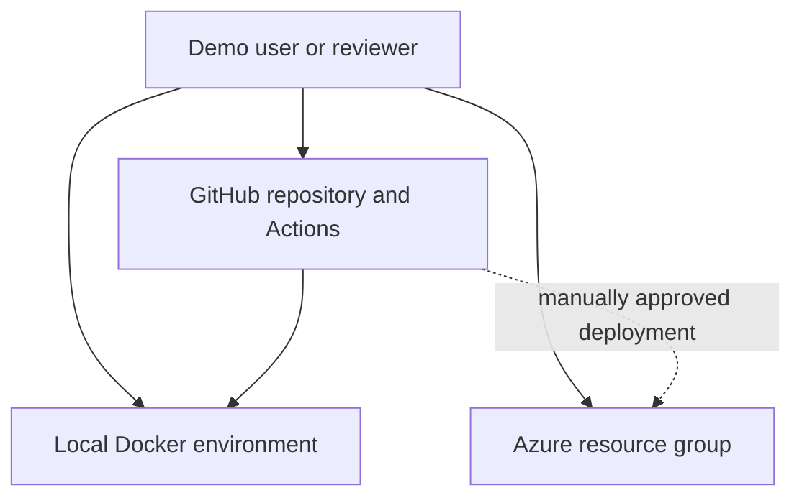
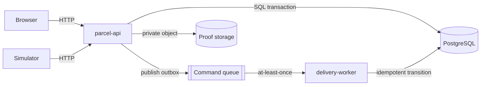
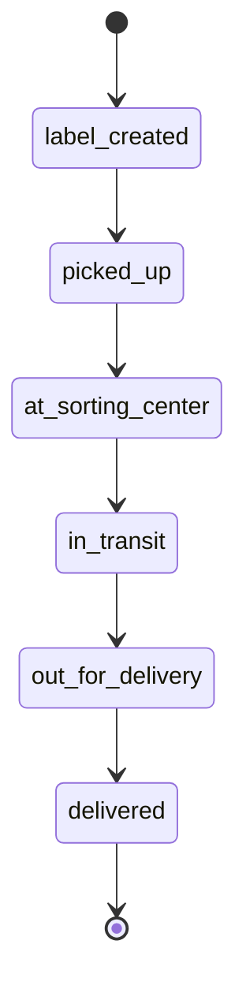
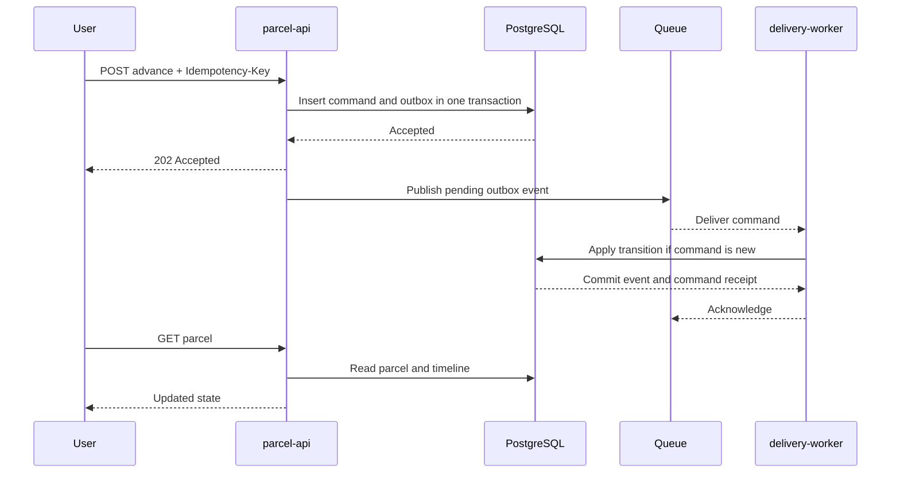
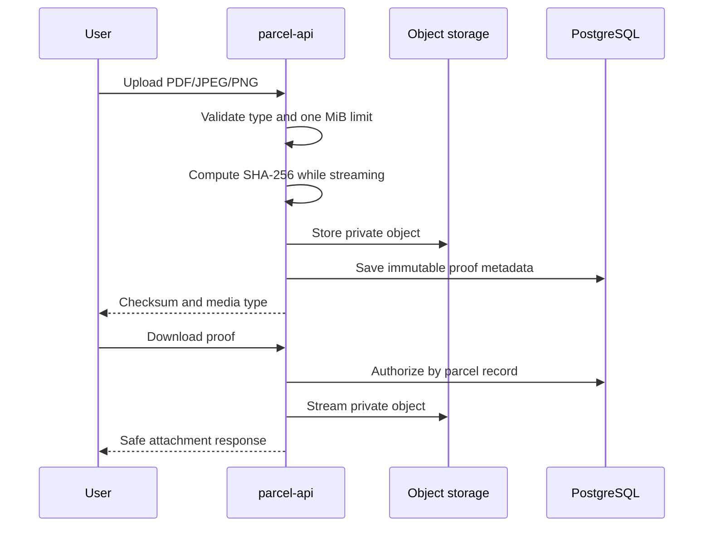
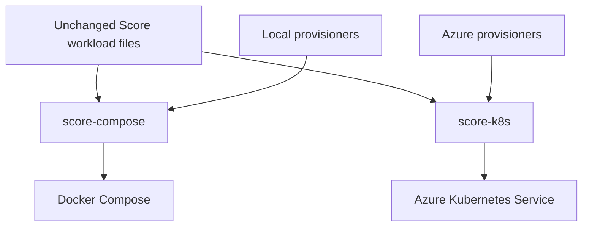
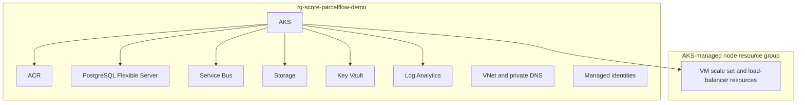

# Architecture

## System context

ParcelFlow demonstrates the same workload definitions against two platform
profiles. Local resources optimize for convenience; Azure resources optimize
for managed operation, workload identity, and explicit lifecycle control.

## Runtime containers

### `parcel-api`

The API owns validation, reads, parcel creation, command acceptance,
proof-of-delivery access, schema migration, and the transactional outbox
publisher. The embedded UI uses the same public API.

### `delivery-worker`

The worker consumes at-least-once command messages and records a transition only
when the command has not already been applied. Duplicate delivery therefore
does not create duplicate timeline events.

### Simulator and smoke client

The simulator is opt-in and operates only through HTTP. It never shares
application internals or database access. The smoke client uses unique test
identifiers and bounded polling so it remains deterministic while the simulator
is running.

## Parcel lifecycle

Each transition records the prior state, new state, command identifier,
timestamp, and correlation identifier.

## Advance-delivery sequence

Publishing may occur more than once if the API crashes after publishing but
before marking the outbox row complete. The worker's command receipt makes this
safe.

## Proof-of-delivery sequence

## Local and Azure deployment

See [ADR 0001](adr/0001-score-as-workload-contract.md) for the boundary and
[Score mapping](score.md) for concrete outputs.

## Azure deployment topology

Azure keeps user-managed resources in one resource group. AKS creates one
additional managed node resource group as an Azure platform requirement.

