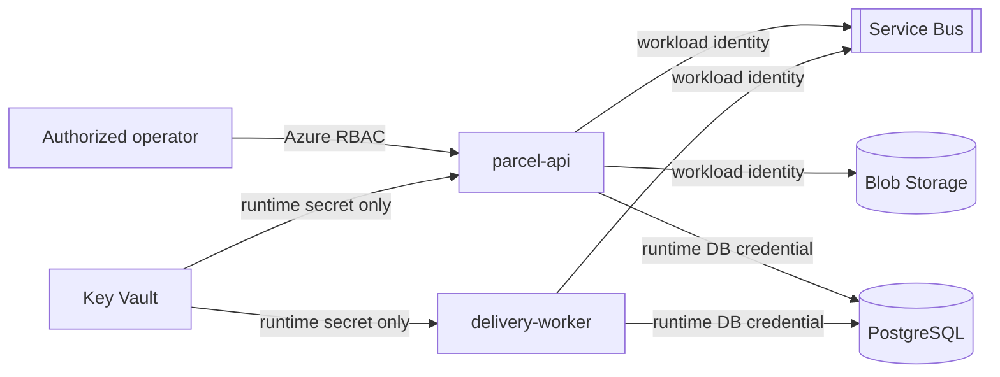

# Security model

## Scope

ParcelFlow demonstrates secure platform boundaries but is not a production
service. It intentionally omits end-user authentication, tenant isolation,
fraud controls, and regulatory controls.

## Trust boundaries

The bootstrap identity is intentionally omitted from the runtime diagram. It
can read both database credentials only while the bootstrap Job runs. Runtime
identities cannot read the administrator secret.

## Controls

- Workloads run as non-root and drop Linux capabilities.
- Kubernetes service-account token mounting is disabled unless workload
  identity requires the projected token.
- Service Bus local authentication and Storage shared-key authorization are
  disabled in Azure.
- Queue sender and receiver roles are separate.
- Proof objects are private and reachable only through the API.
- Score state is stored in a separate container unavailable to applications.
- PostgreSQL is reachable only through the VNet and private DNS.
- Key Vault and Storage use default-deny network ACLs.
- ACR admin and anonymous access are disabled.
- Input lengths, media types, and upload sizes are bounded.
- Mutation commands require idempotency keys.
- Logs use correlation IDs and must not contain credentials or proof contents.

## Public exposure

The default deployment uses `kubectl port-forward`. The API has no user
authentication, so a public endpoint must not be enabled casually.

Any temporary public profile must provide TLS, source-IP restriction,
rate-limiting, request and upload limits, monitoring, and automatic expiration.
It must be removed immediately after the presentation.

## Secret lifecycle

PostgreSQL administrator and application credentials are generated independently
and stored in Key Vault. Rotation updates PostgreSQL, Key Vault, CSI-synced
runtime secrets, and workload pods in that order.

Never place credentials in:

- Score workload files or provisioner source
- Bicep outputs
- generated manifests or checked-in parameter files
- command-line arguments
- CI logs or build artifacts
- GitHub Actions repository variables

## Threats intentionally not solved

- authentication and authorization for delivery customers;
- malicious tenant isolation;
- malware scanning for proof files;
- denial-of-service protection for a public endpoint;
- legal retention and privacy requirements;
- supply-chain signing and admission enforcement.

These omissions are documented rather than represented as production-ready
security.
